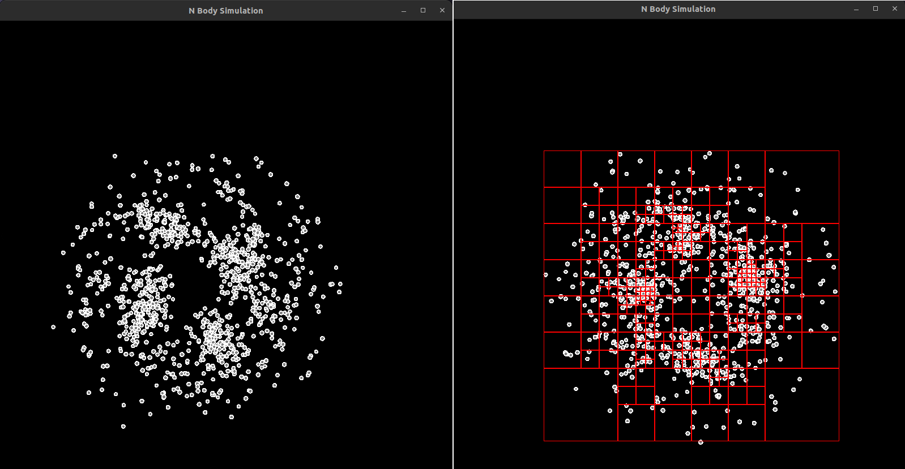
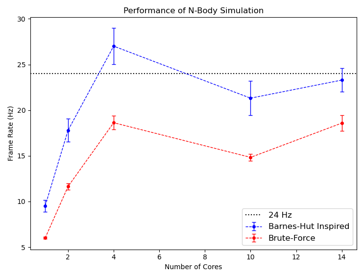

[![MIT License][license-shield]][license-url]
[![LinkedIn][linkedin-shield]][linkedin-url]

    <h3 align="center">N-Body Simulation Using MPI</h3>

  
Table of Contents

  <ol>
    <li>
      <a href="#about-the-project">About The Project</a>
      <ul>
        <li><a href="#performance-on-1540-bodies">Performance on N=1540 Bodies</a></li>
      </ul>
    </li>
    <li>
      <a href="#getting-started">Getting Started</a>
      <ul>
        <li><a href="#prerequisites">Prerequisites</a></li>
        <li><a href="#running-the-application">Running the Application</a></li>
      </ul>
    </li>
    <li><a href="#improvements">Improvements</a></li>
    <li><a href="#license">License</a></li>
  </ol>

## About The Project

 

    
     
    <figcaption>Figure 1. Simulation of 1000 particles. The red bounding boxes in the right screenshot represent the recursive decomposition of space into sub-quadrants by the quadtree data structure.</figcaption>

 

This application simulates the trajectories of bodies in an N-body system. Its main features can be summarized as
follows:

- __Visualization__: The motion of particles is animated using the [SFML][sfml-url] library.
- __Parallelization__: The application is an [MPI][mpi-url] program that delegates the computation into a configurable
  number of MPI processes. The root process is responsible for updating the screen with the positions of the new
  particles. All processes share an array of objects of type `Particle`, an instance of which holds information such as
  mass, radius, position, velocity, and acceleration. Only one copy of this array exists and is shared among all
  processes using _MPI-3 shared memory programming_. This brings us into an important assumption that is made when
  running this application: __The application must be executed with MPI processes that all belong to the same memory
  domain__. In other words, when running this application in a multi-node cluster, restrict the execution to a single
  node in which all ranks in `MPI_COMM_WORLD` belong to same memory domain. Each process is assigned a contiguous
  segment of the array for updating particle data.
- __Optimization__: The application offers two modes for computing the acceleration of the particles. In the brute-force
  approach, the acceleration of a particle must be adjusted by the gravitational influence from each particle in the
  system. Since this must be done for each particle in the system, this results to a time complexity of O($n^{2}$). The
  second approach is a modification of the Barnes-Hut algorithm which uses a quadtree to group particles that are close
  to each other. When a group is sufficiently far away, it is treated as a single particle with a mass and position
  equal to the group's total mass and centre of mass, respectively. In this application, we only consider groups that
  are leaf nodes in the quadtree.
- __Mechanics__: The dynamics of the system is governed by Newton's law of gravity:

  $$F = \frac{Gm_{1}m_{2}}{r^{2}}$$

  The position of a particle is updated using Euler's integration as follows:

  $$\Delta a$$

### Performance on N=1540 Bodies

    

## Getting Started

To get a local copy up and running follow these simple steps.

### Prerequisites

### Running the Application

## Improvements

## License

Distributed under the MIT License. See `LICENSE.txt` for more information.

<!-- MARKDOWN LINKS & IMAGES -->
<!-- https://www.markdownguide.org/basic-syntax/#reference-style-links -->

[license-url]: LICENSE.txt

[linkedin-url]: https://www.linkedin.com/in/faerlin-pulido/

[sfml-url]: https://www.sfml-dev.org/

[mpi-url]: https://www.mpi-forum.org/

[license-shield]: https://img.shields.io/github/license/othneildrew/Best-README-Template.svg?style=for-the-badge

[linkedin-shield]: https://img.shields.io/badge/-LinkedIn-black.svg?style=for-the-badge&logo=linkedin&colorB=555