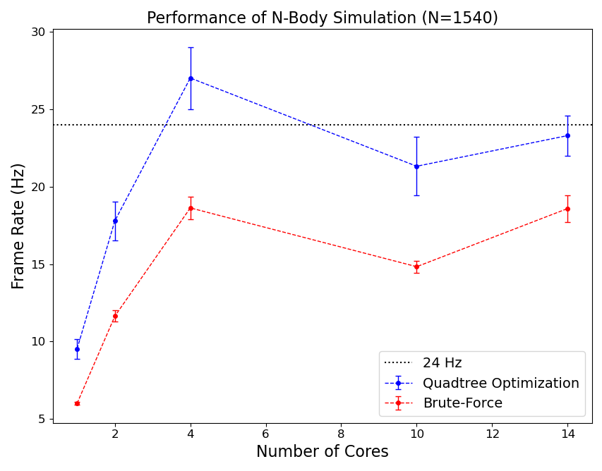

[![MIT License][license-shield]][license-url]
[![LinkedIn][linkedin-shield]][linkedin-url]

    <h3 align="center">N-Body Simulation</h3>

  
Table of Contents

  <ol>
    <li>
      <a href="#about-the-project">About The Project</a>
      <ul>
        <li><a href="#built-with">Built With</a></li>
      </ul>
    </li>
    <li>
      <a href="#getting-started">Getting Started</a>
      <ul>
        <li><a href="#prerequisites">Prerequisites</a></li>
        <li><a href="#running-the-application">Running the Application</a></li>
      </ul>
    </li>
    <li><a href="#improvements">Improvements</a></li>
    <li><a href="#license">License</a></li>
  </ol>

## About The Project

 

    
     
    <figcaption>Figure 1. Simulation of 1000 particles. The red bounding boxes in the right screenshot represent the decomposition of space into sub-quadrants by the quadtree data structure.</figcaption>

 

This application simulates the trajectories of bodies in an N-body system. Its main features can be summarized into
three broad categories:

- __Visualization__: The motion of the particles in system is animated using the [SFML][sfml-url] library.
- __Parallelization__:
- __Optimization__:

    

### Built With

* [MPI][mpi-url] Message Passing Interface
* [SFML][sfml-url] Simple and Fast Multimedia Library

## Getting Started

To get a local copy up and running follow these simple steps.

### Prerequisites

### Running the Application

## Improvements

## License

Distributed under the MIT License. See `LICENSE.txt` for more information.

<!-- MARKDOWN LINKS & IMAGES -->
<!-- https://www.markdownguide.org/basic-syntax/#reference-style-links -->

[license-url]: LICENSE.txt

[linkedin-url]: https://www.linkedin.com/in/faerlin-pulido/

[sfml-url]: https://www.sfml-dev.org/

[mpi-url]: https://www.mpi-forum.org/

[license-shield]: https://img.shields.io/github/license/othneildrew/Best-README-Template.svg?style=for-the-badge

[linkedin-shield]: https://img.shields.io/badge/-LinkedIn-black.svg?style=for-the-badge&logo=linkedin&colorB=555